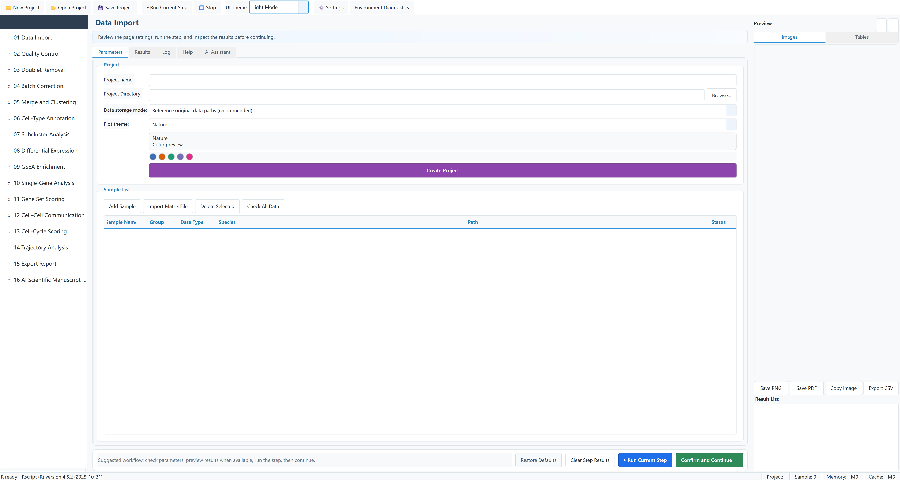

# scFlow Studio Agent

**scFlow Studio Agent** is a desktop application for interactive single-cell RNA-seq analysis. It combines a PySide6 interface with a bundled R/Seurat environment and a project-based workflow covering data import, quality control, doublet removal, batch correction, clustering, annotation, downstream statistics, visualization, and export.

## Current release

| Platform | Release | Distribution | Licensing information |
| --- | --- | --- | --- |
| Windows x64 | **scFlow Studio Agent V0.1.0** | [GitHub Release](https://github.com/oligodendrocyte11/scFlow-Studio/releases/tag/windows-agent-v0.1.0) | Managed within the application; see the bundled User Manual. |
| macOS arm64 | **scFlow Studio Agent V0.1.0** | [GitHub Release](https://github.com/oligodendrocyte11/scFlow-Studio/releases/tag/macos-agent-v0.1.0) | Managed within the application; see the bundled User Manual. |

The Windows installer and macOS DMG are distributed as GitHub Release assets rather than committed to Git history. SHA-256 checksums are provided with each release. The complete English Windows guide is available as [`scFlow-Studio-Agent-V0.1.0-User-Manual.docx`](docs/scFlow-Studio-Agent-V0.1.0-User-Manual.docx), and the English macOS guide is included with the macOS release.

## Main workflow

1. Data Import
2. Quality Control
3. Doublet Removal
4. Batch Correction
5. Merge and Clustering
6. Cell-Type Annotation
7. Subcluster Analysis
8. Differential Expression
9. GSEA Enrichment
10. Single-Gene Analysis
11. Gene Set Scoring
12. Cell–Cell Communication
13. Cell-Cycle Scoring
14. Trajectory Analysis
15. Export Report
16. AI Scientific Manuscript Agent

## Supported inputs

Depending on the selected workflow, the Windows release supports:

- 10X Matrix Market folders (`matrix.mtx[.gz]`, `barcodes.tsv[.gz]`, and `features.tsv[.gz]` or `genes.tsv[.gz]`)
- Expression matrices in CSV, TSV, or TXT format, optionally compressed
- H5AD / AnnData files, including single-sample and multi-sample objects
- GEO-style compressed archives and sidecar-metadata-assisted matrices
- Compatible Seurat RDS objects where supported by the selected page
- Marker CSV files, custom gene lists, and GMT gene-set files

## Windows requirements

- Windows 10 or Windows 11, 64-bit
- Approximately 1.60 GB for the installer and about 4.72 GB after installation
- At least 16 GB RAM; 32 GB or more is recommended for larger datasets
- Additional free space for project data, caches, temporary R preparation, and exports
- Internet access only for optional online references or AI-provider features

The release bundles R 4.5.2, Seurat 5.4.0, SeuratObject 5.3.0, the required R package library, and the application Python runtime. Users should keep **Settings > Rscript Path** on **Auto** unless diagnosing an environment problem.

## Windows quick start

1. Download `scFlow Studio Agent V0.1.0 Setup.exe` from the Windows release.
2. Verify the SHA-256 checksum in `CHECKSUMS.txt`.
3. Run the installer. Windows SmartScreen may warn because this build is not digitally signed.
4. Launch **scFlow Studio Agent V0.1.0**.
5. Create a project outside the software installation directory.
6. Import samples, confirm sample names and biological groups, and run the numbered workflow from top to bottom.

See [`INSTALL.md`](INSTALL.md), [`QUICK_START.md`](QUICK_START.md), and the [complete Word manual](docs/scFlow-Studio-Agent-V0.1.0-User-Manual.docx) for detailed instructions and a GSE250245 example.

## Licensing and activation

Licensing and activation are managed within the application. Platform-specific instructions are provided in each release and the bundled User Manual.

## Outputs

The application can export:

- Figures: PNG, PDF, SVG
- Tables: CSV, TSV, TXT
- Objects: Seurat RDS and H5AD where supported
- Project packages, analysis summaries, and report materials

## Source and reproducibility

Project-owned source files are available in `source/`. Large bundled runtime folders and installers are not committed to Git history. Reproducing a packaged release additionally requires the matching bundled R/Python runtimes and third-party resources described in the build documentation.

For comparable analysis runs, keep the application version, input files, sample order, parameters, random seed, and bundled runtime identical.

## Citation

The archived project release is available at https://doi.org/10.5281/zenodo.20207686. Citation metadata is provided in [`CITATION.cff`](CITATION.cff).

## License

scFlow Studio is available for non-commercial academic use. Project-owned source code is provided under the PolyForm Noncommercial License 1.0.0. Third-party components retain their original licenses.

See [`LICENSE`](LICENSE), [`NOTICE`](NOTICE), [`THIRD_PARTY_LICENSES.md`](THIRD_PARTY_LICENSES.md), and [`DATA_LICENSE.md`](DATA_LICENSE.md).
